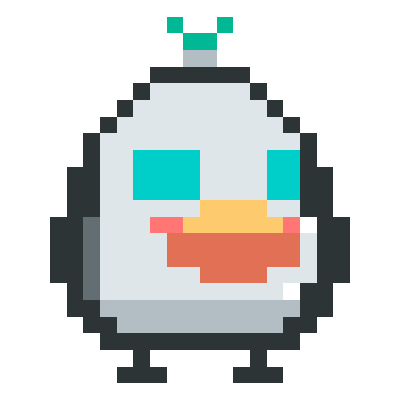

<center>
  
</center>

#  Noobot 

Noobot 是一个前后端分离的智能对话系统，基于 Node.js 与 Vue 构建。项目内置了强大的 Agent 后端、流畅的聊天前端，并提供了一键部署脚本，助您快速搭建属于自己的 AI 助手工作站。

> **⚠️ 免责声明**：本项目主要用于学习与研究，请勿直接用于生产环境；如用于生产，风险与合规责任由使用者自行承担。
> 
> **🛡️ 安全提示**：建议优先在隔离沙箱环境（如 Docker / 独立测试机）中安装和运行。

---

## ✨ 功能概览

- **👥 多用户隔离**：按用户目录独立存储工作区，数据互不干扰。
- **🧠 智能会话与记忆**：支持新建会话、续聊、历史记录，具备长短期记忆机制，实现会话记忆沉淀。
- **🛠️ 丰富的工具与技能**：
  - 支持文件读写、脚本执行、文档解析等工具调用能力。
  - 可扩展的技能目录与任务流程。
  - **兼容 OpenClaw**，可无缝复用/迁移 OpenClaw 风格技能。
- **⚡ 极致体验**：支持 SSE 流式输出，前端实时呈现生成过程。
- **🚀 极简部署**：
  - `start.sh` 一键完成：代码更新、依赖安装、前端构建、PM2 进程重建。
  - 前端通过 Caddy 提供静态服务并反代后端 API。
  - PM2 项目内托管（`PM2_HOME=.pm2`），零系统环境污染。

---

## 📂 项目结构

```text
noobot/
├── service/                  # Node.js 后端（Agent 核心、会话、记忆、工具调用）
├── client/noobot-chat/       # Vue 前端（基于 Vite 构建）
│   └── deploy/               # Caddy 配置与启动脚本
├── start.sh                  # 一键更新/安装/构建/启动脚本
└── README.md                 # 项目说明文档
```

---

## 🏗️ 架构说明

### 1. 整体架构

```text
[ Browser ] 
    │
    ▼
[ Caddy ] ──(提供静态资源)──> dist/
    │
    └───(反向代理 /api)───> [ Service ] (Express + Agent Runtime)
                               │
                               ├──> Models (大模型 API)
                               ├──> Tools (工具调用)
                               └──> Workspace (会话状态与记忆存储)
```

### 2. 请求链路

1. 浏览器访问前端页面（由 Caddy 提供 `dist` 静态文件）。
2. 前端请求 `/api/*`，由 Caddy 反代至 `API_UPSTREAM`（默认 `127.0.0.1:10061`）。
3. 后端处理会话逻辑、上下文、记忆检索和工具调用。
4. 结果以普通响应或 **SSE 流式** 返回给前端。

### 3. 运行与进程管理

- **统一启动**：`start.sh` 依次执行 `更新代码 → 安装依赖 → 构建前端 → 重建 PM2 进程`。
- **双进程托管**：PM2 负责守护 `noobot-service`（后端）与 `noobot-client`（前端 Caddy 服务）。
- **环境隔离**：PM2 数据目录固定为项目内的 `.pm2/`，避免污染系统默认的 `~/.pm2`。

> 💡 *后端详细实现可查看：[`service/README.md`](./service/README.md)*

---

## ⚙️ 环境要求

- **Node.js**: v18+（推荐 v20+）
- **npm**: v9+
- **OS**: Linux / macOS（脚本会自动下载并配置 Caddy）

### 系统依赖（用于文档与多媒体处理）
- `libreoffice`（文档转换）
- `ffmpeg`（音视频处理）

> 📌 `./start.sh` 会在启动时检查并尝试自动安装以上依赖（需 root 或 sudo 权限）。若自动安装失败，请手动安装后重试。

---

## 🚀 快速开始

### 1. 克隆与配置

```bash
# 1. 克隆项目
git clone https://github.com/xiayu1987/noobot.git
cd noobot

# 2. 创建后端配置文件
cp service/config/global.config.example.json service/config/global.config.json

# 3. 赋予脚本执行权限
chmod +x start.sh
```

> **⚠️ 首次运行前必读**：
> 请务必编辑 `service/config/global.config.json`：
> - 设置默认模型：`defaultProvider`
> - 配置对应 Provider（如 `qwen3_5_flash` / `openai`）的 `api_key`、`base_url`、`model`
> - 确保启用的 Provider（`enabled: true`）已填写有效的 API Key。

### 2. 一键启动

```bash
./start.sh
```

启动完成后，控制台将输出：
- **前端访问地址**：默认 `http://127.0.0.1:10060`
- **后端 API 地址**：默认 `http://127.0.0.1:10061`

---

## 🛠️ 常用配置

### 1. 启动脚本环境变量 (`start.sh`)

可以通过注入环境变量来修改默认端口：
- `CADDY_ADDR`：前端监听地址（默认 `:10060`）
- `API_UPSTREAM`：前端反代目标（默认 `127.0.0.1:10061`）

**示例：**
```bash
CADDY_ADDR=:8080 API_UPSTREAM=127.0.0.1:3001 ./start.sh
```

### 2. 后端端口配置

后端端口由 `service/.env` 控制，可参考 `service/.env.example`：
```env
PORT=10061
```

### 3. 后端核心配置与参数化

- **核心配置**：配置项较多，完整说明请务必查看 **[CONFIGURATION.md](./CONFIGURATION.md)**。
- **参数化配置**：配置文件支持 `${VAR_NAME}` 占位符（如 `${DASHSCOPE_API_KEY}`），运行时会自动解析环境变量。详细规则与优先级见配置文档。

---

## 📊 进程管理 (PM2)

本项目使用局部 PM2 (`PM2_HOME=.pm2`)。如需管理进程，请在 `service/` 目录下执行以下命令：

```bash
cd service

npm run pm2:list    # 查看运行中的进程
npm run pm2:logs    # 查看实时日志
npm run pm2:stop    # 停止服务
npm run pm2:delete  # 删除进程
```

---

## ❓ 常见问题 (FAQ)

**Q1: 为什么 `npx pm2 list` 看不到进程？**  
A: 因为项目使用了局部 PM2 目录。请进入 `service` 目录并使用 `npm run pm2:list` 命令查看。

**Q2: 前端 Caddy 二进制文件下载到哪里了？**  
A: 默认存放在：`client/noobot-chat/deploy/bin/caddy`。

**Q3: 页面报错 `Client sent an HTTP request to an HTTPS server` 怎么办？**  
A: 请确认您是通过 `http://` 访问的页面，并且 `Caddyfile` 中配置的是 `http://{$CADDY_ADDR...}` 而非 https。

---

## 📄 开源协议

本项目采用 [MIT License](./LICENSE) 开源协议。

## ✉️ 联系维护者

- Email: 126240622+xiayu1987@users.noreply.github.com