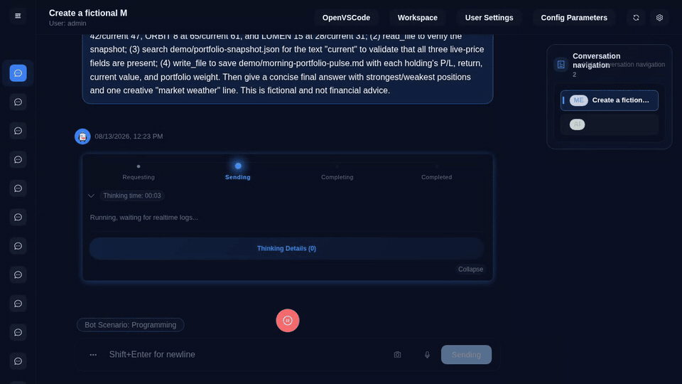
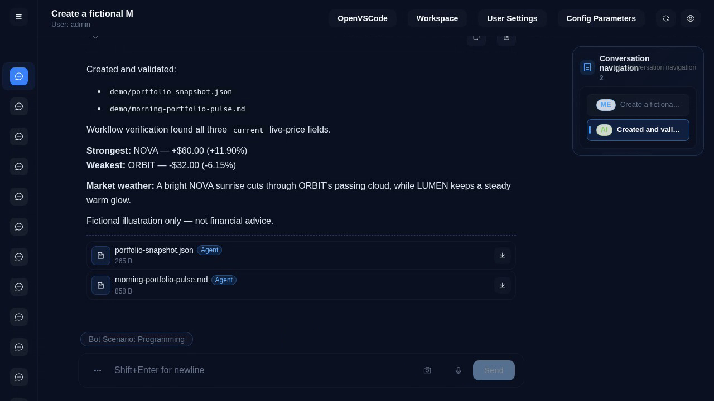

# Noobot

**Self-hosted AI agent workspace for tool calling, multi-model routing, MCP, and multi-agent workflows.**

[中文](./README.zh-CN.md) | English

[](https://github.com/xiayu1987/noobot/releases/latest)
[](https://github.com/xiayu1987/noobot/releases)
[](https://github.com/xiayu1987/noobot/stargazers)
[](https://github.com/xiayu1987/noobot/actions/workflows/quality-checks.yml)
[](./LICENSE)


[Windows installer](https://github.com/xiayu1987/noobot/releases/latest) (choose `Noobot.Setup.<version>.exe`) · [macOS package](https://github.com/xiayu1987/noobot/releases/latest) (choose `Noobot-<version>-mac.zip`) · [Configuration](./CONFIGURATION.md) · [Discussions](https://github.com/xiayu1987/noobot/discussions)

Noobot is an open-source Web and desktop AI agent application built with Node.js, Vue 3, and Electron. It provides isolated user workspaces, durable sessions, extensible tools, semantic workflows, and OpenAI-compatible or DashScope model access from one self-hosted deployment.

Co-creators: Hyler · Epicur · gonglei · Z · Y · C

## See Noobot in Action

An English demo of a fictional portfolio analysis: Noobot verifies source data, chains four file tools, surfaces the live analysis flow, and publishes reusable report attachments.



<details>
<summary>View the completed analysis</summary>



</details>

## Why Noobot

- **Agent workspace:** multi-user workspace and session isolation with persistent attachments and execution history.
- **Tools and skills:** file operations, native/script execution, browser automation, LibreOffice, FFmpeg, multimodal parsing/generation, services, and reusable skills.
- **Model interoperability:** OpenAI-compatible and DashScope interfaces, provider/model-family routing, tool calling, streaming, and multimodal capability configuration.
- **Multi-agent orchestration:** task delegation, semantic workflows, workflow plugins, and harness-based planning/guidance/review.
- **MCP and connectors:** MCP servers plus database, terminal, email, and custom service connectors.
- **Web and desktop:** Vue 3 Web client and packaged Electron clients for Windows and macOS.
- **Self-hosted operations:** one-command PM2 + Caddy deployment, runtime audit events, replay, sanitization, and bilingual UI/configuration.

## Get Noobot

| Option                   | Download or command                                                                                             | Notes                                     |
| ------------------------ | --------------------------------------------------------------------------------------------------------------- | ----------------------------------------- |
| Windows installer        | [Latest release](https://github.com/xiayu1987/noobot/releases/latest), then choose `Noobot.Setup.<version>.exe` | Recommended for Windows                   |
| Windows packaged archive | [Latest release](https://github.com/xiayu1987/noobot/releases/latest), then choose `Noobot-<version>-win.zip`   | ZIP distribution without the setup wizard |
| macOS packaged archive   | [Latest release](https://github.com/xiayu1987/noobot/releases/latest), then choose `Noobot-<version>-mac.zip`   | Packaged macOS desktop client             |
| Self-hosted Web          | [`./start.sh`](#quick-start)                                                                                    | Linux or macOS server deployment          |

## Quick Start

```bash
git clone https://github.com/xiayu1987/noobot.git
cd noobot

chmod +x start.sh
./start.sh
```

Notes:

- `start.sh` runs the project launcher first (`scripts/project-launcher.mjs`).
- If `service/config/global.config.json` does not exist, an interactive setup wizard will create it.
- For non-interactive environments, initialize with env vars (example):

```bash
NOOBOT_MODEL_FORMAT=openai_compatible \
NOOBOT_MODEL_NAME=gemini-3-flash \
NOOBOT_MODEL_API_KEY=xxx \
NOOBOT_MODEL_BASE_URL=https://example.com/v1 \
./start.sh
```

Optional: `NOOBOT_SETUP_LANG=zh|en` (controls setup wizard language and synchronizes `preferences.language` plus built-in config copy text localization).

Default endpoints:

- Frontend: `http://127.0.0.1:10060`
- Backend: `http://127.0.0.1:10061`
- Agent Proxy: `http://127.0.0.1:10062`
- Model proxy endpoints are generated from your configured providers.

Stop all services:

```bash
chmod +x stop-services.sh
./stop-services.sh
```

## Requirements

- Node.js 22.22.2+
- npm 9+
- Linux/macOS

## Workspace Dependency Management

This repo uses npm workspaces at root (`noobot/package.json`).

```bash
cd noobot
npm install --workspaces
```

Useful commands:

```bash
# run all test scripts that exist
npm run test

# development servers
npm run dev:service
npm run dev:agent-proxy
npm run dev:client

# build the startup UI and web client
npm run build
```

The root `package.json` is the source of truth for the current workspace list and
repository-wide scripts. Package-specific scripts can also be run with
`npm run -w <workspace> <script>`.

Optional system deps:

- `libreoffice` (Office document conversion)
- `ffmpeg` (audio/video processing)
- `docker` (programmable workspace compute sandbox)

## Desktop Packaging

Install dependencies first from the repository root:

```bash
npm install --workspaces
```

Then choose one of the following equivalent approaches.

From the repository root (the root scripts already select the workspace with
`-w`):

```bash
# Build the Windows desktop package
npm run build:windows

# Build the macOS desktop package
npm run build:mac
```

Or run the workspace script from the corresponding desktop client directory:

```bash
# Windows (run from client/windows)
cd client/windows
npm run build:win

# macOS (run from client/mac)
cd ../mac
npm run build:mac
```

The commands prepare the frontend, Electron client, and backend before invoking
`electron-builder`. The generated artifacts are written to the corresponding
desktop client's `dist/` directory.

## Config

- Main config doc: [`CONFIGURATION.md`](./CONFIGURATION.md)
- Session log WebSocket, retention, and debug switches are documented in [`CONFIGURATION.md`](./CONFIGURATION.md#2-environment-variables).
- Contributing guide: [`CONTRIBUTING.md`](./CONTRIBUTING.md)
- Coding standard: [`CODING-STANDARD.md`](./CODING-STANDARD.md)
- Backend docs: [English](./service/README.md) | [中文](./service/README.zh-CN.md)

Environment variables for `start.sh`:

- `CADDY_ADDR` (default `:10060`)
- `AGENT_PROXY_UPSTREAM` (default `127.0.0.1:10062`)
- `PORT` (service port, default `10061`)

Example:

```bash
CADDY_ADDR=:8080 PORT=3001 AGENT_PROXY_UPSTREAM=127.0.0.1:3002 \
AGENT_PROXY_PORT=3002 ./start.sh
```

## PM2 (local)

> The PM2 scripts below manage one package at a time and do not run the project
> initialization launcher. For first-time deployment, dependency installation,
> frontend build, or config auto-sync, use `./start.sh`.

```bash
cd service && npm run pm2:list
cd service && npm run pm2:logs
cd service && npm run pm2:stop
cd service && npm run pm2:delete

cd agent-proxy && npm run pm2:list
cd agent-proxy && npm run pm2:logs
cd agent-proxy && npm run pm2:stop
cd agent-proxy && npm run pm2:delete

cd model-proxy && npm run pm2:list
cd model-proxy && npm run pm2:logs
cd model-proxy && npm run pm2:stop
cd model-proxy && npm run pm2:delete
```

## License

[MIT](./LICENSE)
