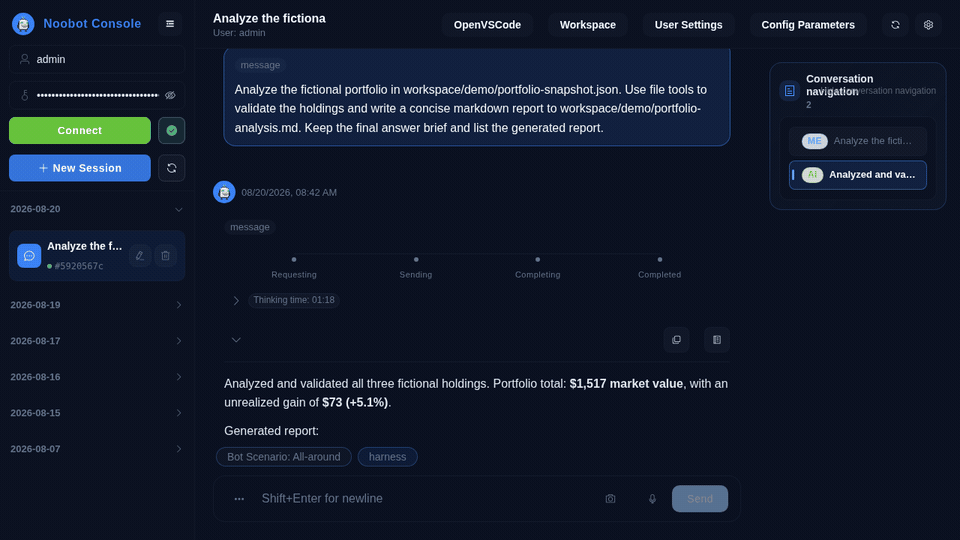
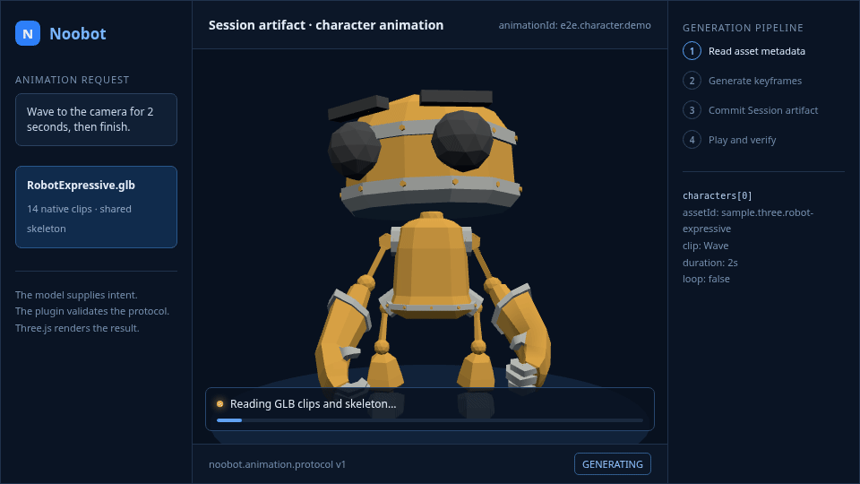
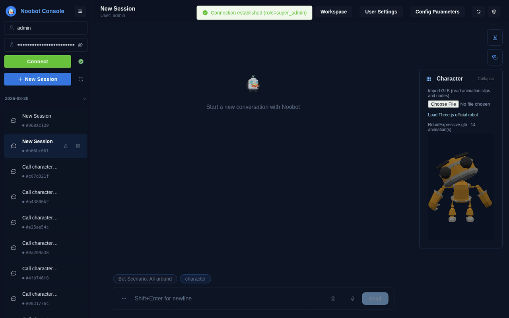
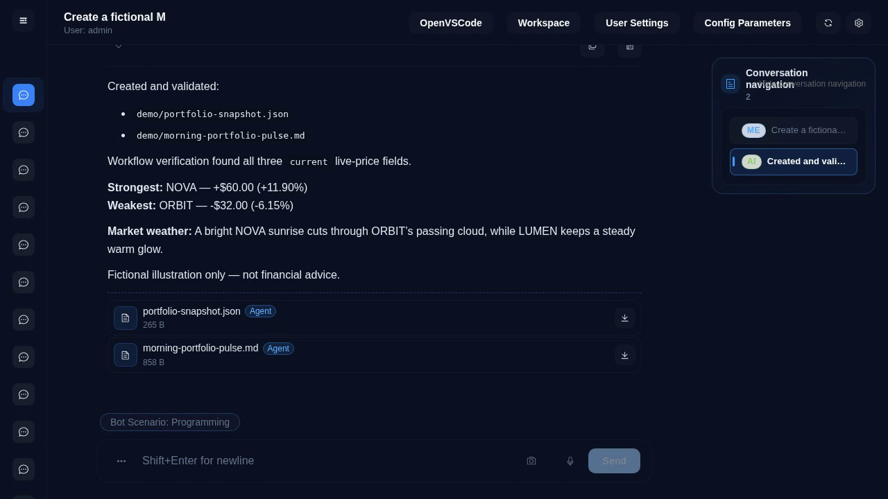

# 菜鸟机器人（Noobot）

告别 1 美元的 hello world 时代。

**便宜 省钱 支持工具调用、多模型路由、MCP 与多智能体工作流的自托管 AI Agent 工作空间。**

中文 | [English](./README.md)

[](https://github.com/xiayu1987/noobot/releases/latest)
[](https://github.com/xiayu1987/noobot/releases)
[](https://github.com/xiayu1987/noobot/stargazers)
[](https://github.com/xiayu1987/noobot/actions/workflows/quality-checks.yml)
[](./LICENSE)


[Windows 安装程序](https://github.com/xiayu1987/noobot/releases/latest)（选择 `Noobot.Setup.<版本>.exe`）· [macOS 客户端](https://github.com/xiayu1987/noobot/releases/latest)（选择 `Noobot-<版本>-mac.zip`）· [配置文档](./CONFIGURATION.zh-CN.md) · [参与讨论](https://github.com/xiayu1987/noobot/discussions)

Noobot 是基于 Node.js、Vue 3 和 Electron 构建的开源 Web 与桌面 AI Agent 应用。它在一个自托管部署中提供隔离用户工作区、持久会话、可扩展工具、语义工作流，以及跨 OpenAI 兼容供应商的模型系列路由。

共创者：Hyler · Epicur · gonglei · Z · Y · C

## Noobot 实际运行效果

全英文虚构股票组合分析演示：Noobot 验证源数据、串联四次文件工具调用、实时展示分析过程，并将结果发布为可复用的报告附件。



### 用一句话制作 3D 角色动画

导入一个带基础动作的 3D 角色，告诉 Noobot 你想让它做什么，就能看到角色按你的
描述连续表演。你可以制作单人或多人动画，让角色挥手、行走、跳跃和互动，也可以
在后续对话中继续调整动作、节奏与位置，无需编写动画代码。



下面是 Noobot 真实系统录制：从导入并选择角色，到用自然语言生成一段连续动画，
再到角色完成待机、挥手、跳跃、行走和收尾动作。整个创作和播放过程都在会话中完成：



生成的动画会保存为当前会话的作品。刷新页面后仍能查看，也可以在任意后续对话中
接着修改，不必向上查找最初的消息。

开始制作只需三步：打开“角色功能”并导入角色，在“更多操作”中勾选一个或多个
角色，然后用自然语言描述你想看到的动作。

<details>
<summary>查看完成后的分析结果</summary>



</details>

## 为什么选择 Noobot

- **Agent 工作空间：** 多用户工作区和会话隔离，支持持久附件与执行历史。
- **工具与技能：** 文件操作、原生/沙箱脚本、浏览器自动化、LibreOffice、FFmpeg、多模态解析与生成、服务和可复用技能。
- **模型互操作：** OpenAI 兼容供应商接口，按运营商/模型系列路由，支持工具调用、流式响应与多模态能力配置。
- **多智能体编排：** 任务委派、语义工作流、Workflow 插件，以及 Harness 规划/指导/审查。
- **MCP 与连接器：** 支持 MCP Server，以及数据库、终端、邮件和自定义服务连接器。
- **AI 角色动画：** 导入 3D 角色后用自然语言制作、预览并持续修改单人或多人动画。
- **Web 与桌面端：** Vue 3 Web 客户端，以及 Windows 和 macOS Electron 客户端。
- **自托管运维：** PM2 + Caddy 一键部署，提供运行审计、重放、数据清洗和中英文配置。

## 获取 Noobot

| 方式             | 下载或命令                                                                                          | 说明                        |
| ---------------- | --------------------------------------------------------------------------------------------------- | --------------------------- |
| Windows 安装程序 | 进入[最新版本](https://github.com/xiayu1987/noobot/releases/latest)，选择 `Noobot.Setup.<版本>.exe` | Windows 推荐下载方式        |
| Windows 打包归档 | 进入[最新版本](https://github.com/xiayu1987/noobot/releases/latest)，选择 `Noobot-<版本>-win.zip`   | 不使用安装向导的 ZIP 分发包 |
| macOS 打包归档   | 进入[最新版本](https://github.com/xiayu1987/noobot/releases/latest)，选择 `Noobot-<版本>-mac.zip`   | 已打包的 macOS 桌面客户端   |
| 自托管 Web       | [`./start.sh`](#快速开始)                                                                           | Linux 或 macOS 服务器部署   |

### 打开 macOS 客户端

macOS 发布包未经 Apple Developer ID 签名，也未经过 Apple 公证。解压 ZIP 后，将 `Noobot.app` 移到“应用程序”文件夹。如果 macOS 阻止打开，先尝试打开一次，再到“系统设置 > 隐私与安全性”点击“仍要打开”。详见 [Apple 的 Gatekeeper 说明](https://support.apple.com/zh-cn/102445)。

也可以在确认下载的发布包可信后，在“终端”中仅移除该应用的隔离属性，再重新打开：

```bash
xattr -dr com.apple.quarantine /Applications/Noobot.app
```

## 快速开始

```bash
git clone https://github.com/xiayu1987/noobot.git
cd noobot

chmod +x start.sh
./start.sh
```

说明：

- `start.sh` 会先执行项目启动引导（`scripts/project-launcher.mjs`）。
- 若 `service/config/global.config.json` 不存在，会进入交互式配置并自动生成配置文件。
- 引导中模型从内置模型库选择；`api_key` 和 `base_url` 可留空，留空时保留模型库中的 `${ENV}` 引用，之后可在 `config-params.json` 中补填；还会选择执行隔离模式（`sandbox` 在 Docker 中执行命令，`host` 直接在本机执行）。
- 在非交互环境可用环境变量初始化（示例）：

```bash
NOOBOT_MODEL_NAME=gemini_3_7_flash \
NOOBOT_MODEL_API_KEY=xxx \
NOOBOT_MODEL_BASE_URL=https://example.com/v1 \
NOOBOT_EXECUTION_ISOLATION_MODE=sandbox \
./start.sh
```

`NOOBOT_MODEL_NAME` 可填模型库 key 或 model 名；`NOOBOT_MODEL_API_KEY`、`NOOBOT_MODEL_BASE_URL` 可选；`NOOBOT_EXECUTION_ISOLATION_MODE` 为 `sandbox`（默认）或 `host`。

可选：`NOOBOT_SETUP_LANG=zh|en`（初始化引导语言，并同步 `preferences.language` 与配置内置文案的中英文文本）。

默认地址：

- 前端：`http://127.0.0.1:10060`
- 后端：`http://127.0.0.1:10061`
- Agent 代理：`http://127.0.0.1:10062`
- 模型代理地址会根据已配置的模型供应商自动生成。

关闭全部服务：

```bash
chmod +x stop-services.sh
./stop-services.sh
```

## 环境要求

- Node.js 24.21.0（推荐，同时兼容 Node.js 26.9.x）
- npm 12.0.2（npm 12.x）
- Linux/macOS

## Workspace 依赖管理

仓库根目录的 `package.json` 已启用 npm workspaces。

```bash
cd noobot
npm install --workspaces
```

常用命令：

```bash
# 运行所有存在 test 脚本的子项目
npm run test

# 启动开发服务
npm run dev:service
npm run dev:agent-proxy
npm run dev:client

# 构建启动页与 Web 客户端
npm run build
```

当前 workspace 列表和仓库级命令以根目录 `package.json` 为准。也可以使用
`npm run -w <workspace> <script>` 运行单个 workspace 的脚本。

可选系统依赖：

- `libreoffice`（Office 文档转换）
- `ffmpeg`（音视频处理）
- `docker`（可编程工作区计算沙箱）

## 模型访问测试

运行 `npm run test:model-access` 打开本地可视化测试程序，复用现有模型配置和调用运行时。支持逐项勾选、修改请求参数，导入 model-proxy 日志，查看实际发送体和原始响应。详见[使用说明](./agent/scripts/model-access-test/README.md)。

## 命令行（CLI）

`noobot` 命令在本进程内执行一轮对话，使用与 service 相同的工作区和配置。在 `service/` 目录下用 `npm run cli -- <参数>` 运行，或在 `service/` 目录执行 `npm link` 安装命令。完整参数以 `noobot --help` 输出为准。

```bash
noobot -p "总结 README.md" -f README.md             # 新建会话并附带文件
echo "继续" | noobot -c                              # 从 stdin 读消息，续接最近一个会话
noobot -r <sessionId> "下一步"                       # 续接指定会话
noobot resume-turn -r <sessionId> --dialog <dialogProcessId> --turn <turnScopeId>
noobot sessions                                      # 列出会话
noobot -o json -p "hi"                               # text | json | stream-json
```

- `-r/--resume <sessionId>` 是唯一的会话选择参数；`-c/--continue` 选最近一个会话。两者互斥，`--connector` 只能在新建会话时使用。
- `resume-turn` 续跑指定轮次，必须同时提供 `-r`、`--dialog` 和 `--turn`。
- 附件类型按扩展名推断，未知扩展名按 `application/octet-stream` 发送。
- 退出码：`0` 完成，`1` 失败，`2` 用法或协议错误，`3` 无法交互，`130` 已停止。
- CLI 使用独立的运行时。service 同时运行时，界面无法停止或恢复 CLI 发起的轮次。

## 桌面端打包

先在仓库根目录安装依赖：

```bash
npm install --workspaces
```

然后任选以下一种等效方式执行。

在仓库根目录执行（根脚本内部已经通过 `-w` 指定对应 workspace）：

```bash
# 构建 Windows 桌面安装包
npm run build:windows

# 构建 macOS 桌面安装包
npm run build:mac
```

也可以进入对应桌面客户端目录，直接执行子项目脚本：

```bash
# Windows（在 client/windows 目录执行）
cd client/windows
npm run build:win

# macOS（在 client/mac 目录执行）
cd ../mac
npm run build:mac
```

这两个命令会依次准备前端、Electron 客户端和后端，然后调用
`electron-builder`。生成的文件位于对应桌面客户端的 `dist/` 目录。

## 配置说明

- 核心配置文档：[`CONFIGURATION.zh-CN.md`](./CONFIGURATION.zh-CN.md)
- Session 日志 WebSocket、保留时间和 debug 开关见 [`CONFIGURATION.zh-CN.md`](./CONFIGURATION.zh-CN.md#2环境变量)
- 贡献指南：[`CONTRIBUTING.zh-CN.md`](./CONTRIBUTING.zh-CN.md)
- 编码规范：[`CODING-STANDARD.md`](./CODING-STANDARD.md)
- 后端说明：[中文](./service/README.zh-CN.md) | [English](./service/README.md)

`start.sh` 可用环境变量：

- `CADDY_ADDR`（默认 `:10060`）
- `AGENT_PROXY_UPSTREAM`（默认 `127.0.0.1:10062`）
- `PORT`（service 端口，默认 `10061`）

示例：

```bash
CADDY_ADDR=:8080 PORT=3001 AGENT_PROXY_UPSTREAM=127.0.0.1:3002 \
AGENT_PROXY_PORT=3002 ./start.sh
```

## PM2（项目内）

> 以下 PM2 命令每次只管理一个子项目，不执行项目初始化引导。首次部署、
> 安装依赖、构建前端或需要自动同步配置时，请使用 `./start.sh`。

```bash
cd service && npm run pm2:list
cd service && npm run pm2:logs
cd service && npm run pm2:stop
cd service && npm run pm2:delete

cd agent-proxy && npm run pm2:list
cd agent-proxy && npm run pm2:logs
cd agent-proxy && npm run pm2:stop
cd agent-proxy && npm run pm2:delete

cd model-proxy && npm run pm2:list
cd model-proxy && npm run pm2:logs
cd model-proxy && npm run pm2:stop
cd model-proxy && npm run pm2:delete
```

## 开源协议

[MIT](./LICENSE)
